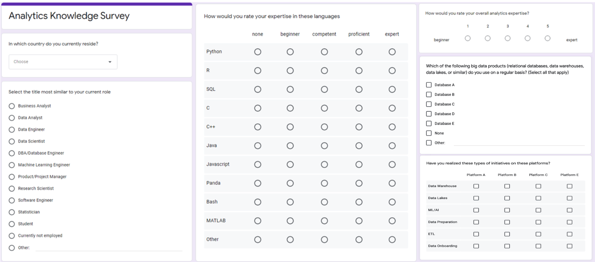
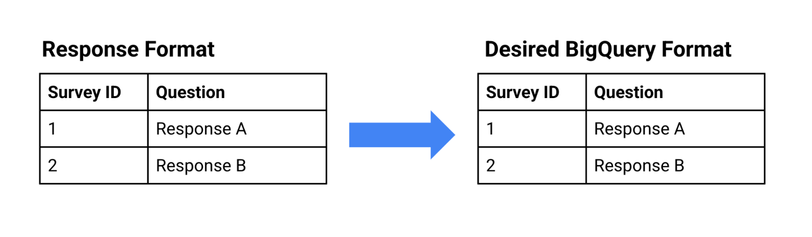
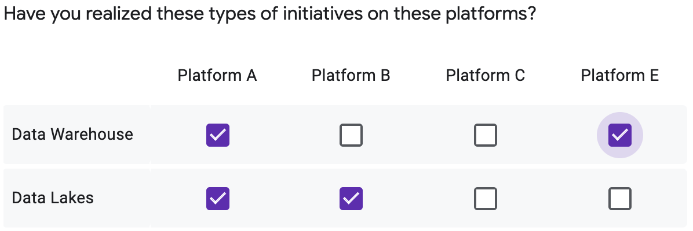
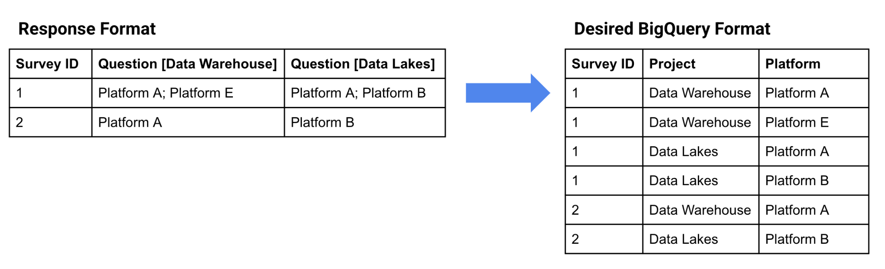
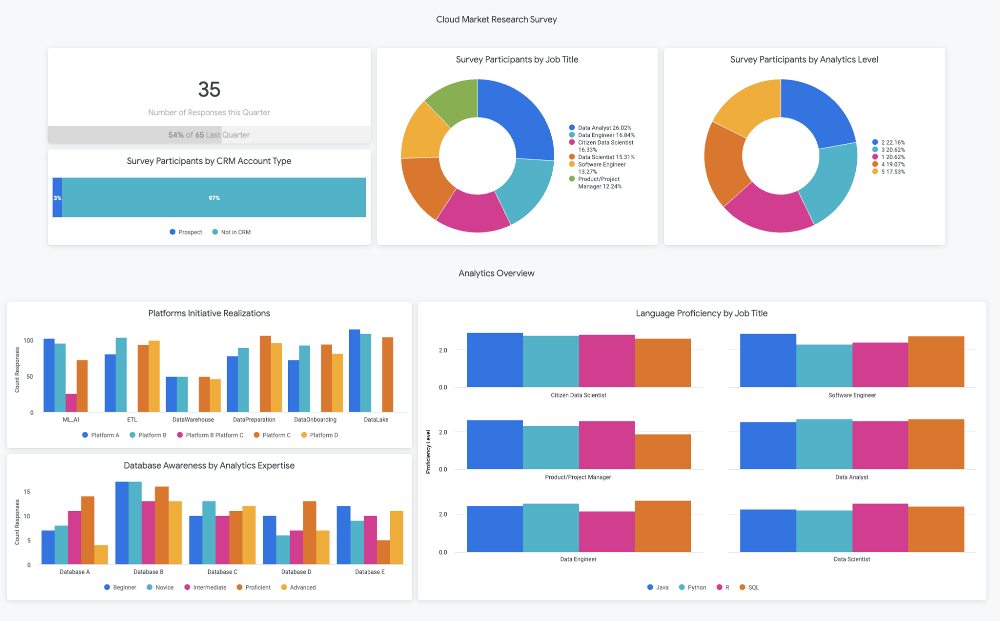

# Driving Insight from Google Forms With a Survey Data Warehouse


## Design an end-to-end automated analytics solution to process and analyze Google Forms survey responses, using Google Sheets, Cloud Dataprep, BigQuery, and Data Studio


There are many reasons to run surveys: assess customer satisfaction, run market research, improve a product or service, or appraise employee engagement. This reference pattern introduces a comprehensive solution to design your survey analytics data warehouse, track responses over time, display the results in beautiful reports to gain insight and take action.

In this guide, we leverage the Google Cloud Smart Analytics suite to build an automated pipeline that captures Google Forms results, prepares the data with Cloud Dataprep, loads it into BigQuery and allows your team to perform visual analytics using tools like Looker or Data Studio.

This tutorial is intended for data engineers or data analysts and assumes that you have basic knowledge of the following:


*   [Google Forms](https://www.google.com/forms/about/) to design and run surveys.
*   [Cloud Dataprep by Trifacta](https://cloud.google.com/dataprep) to reformat the survey results into tables.
*   [BigQuery](https://cloud.google.com/bigquery) data warehouse to store all your survey results in one place.
*   [Data Studio](https://datastudio.google.com) or [Looker](https://looker.com/) to design survey reports and surface trends.

All the assets used in this Design Pattern can be found in this [GitHub repository](https://github.com/trifacta/trifacta-google-cloud/tree/main/design-pattern-google-forms)


# Solution Overview

In this guide, we will run through an example using a [Google Forms survey](https://docs.google.com/forms/d/1kNxBcrWKJzQBzey9W87g9hJtMdJv3evTDnSw44GFUgg/edit) we have put together. However, you can extrapolate your learnings to be applicable for any survey platform. Each individual response to a question has a particular structure based on the question type: single value, multiple choices, grids, etc. When Google Forms is connected to Google Sheets, it creates one row for each survey response, which combines all the questions from the survey. This combined structure can be quite complex, and it makes it challenging to write SQL queries and build reports with Business Intelligence tools. Each row of the spreadsheet must be interpreted, restructured, and broken down into multiple tables to become usable. 

Cloud Dataprep is used to restructure the survey responses using various transformations such as cleaning question names, splitting values, pivoting rows into columns, and routing the results in the appropriate tables in BigQuery. With the survey data pushed into BigQuery, it’s easy to join tables onto existing datasets like other survey responses, CRM data, or product usage metrics.  More so, analysts can now access all of this data inside platforms like Looker or Data Studio. Here, visual analytics is performed to deliver up-to-date and easy-to-consume actionable knowledge.


## Reference Architecture

The following diagram shows the components and the process used to build the automated pipeline.


With the principles mentioned above and this architecture as a guideline, let’s review each step to implement the solution.


## Objectives


*   Using [Google Forms](https://www.google.com/forms/about/), create a survey example and export the answers in a Google Sheets kept in-sync with new responses arrivals.
*   Build a [Cloud Dataprep](https://cloud.google.com/dataprep) flow to structure, clean, and publish the data in the right format for [BigQuery](https://cloud.google.com/bigquery) data warehouse. Here, you can query the survey responses alongside other meaningful data sources that exist in your warehouse.
*   Build compelling reports and dashboards in either [Looker](https://looker.com/) or [Data Studio](https://datastudio.google.com) to deliver up-to-date and easy to consume actionable insight


## Costs

This tutorial uses the following billable components of Google Cloud:


*   [Cloud Dataprep](https://cloud.google.com/dataprep)
*   [BigQuery](https://cloud.google.com/bigquery)
*   [Looker](https://looker.com/) (custom pricing model)

To generate a cost estimate based on your projected usage, use the [pricing calculator](https://cloud.google.com/products/calculator). 


# Before you begin


1. In the Google Cloud Console, on the project selector page, select or create a Google Cloud project.

    **Note**: If you don't plan to keep the resources that you create in this procedure, create a new project instead of selecting an existing project. After you finish these steps, you can delete the project, removing all resources associated with the project.


    [Go to the project selector page](https://console.cloud.google.com/projectselector2/home/dashboard?_ga=2.160760575.336863925.1606037980-454881161.1598040324&_gac=1.187200730.1605625914.Cj0KCQiAhs79BRD0ARIsAC6XpaUEshc6odnj_JRsGRs7YksBGoyLf5QlEBwmp6YpSVvTHYqGq9hfmTMaAhp0EALw_wcB)

2. Make sure that billing is enabled for your Cloud project. [Learn how to confirm that billing is enabled for your project](https://cloud.google.com/billing/docs/how-to/modify-project)<span style="text-decoration:underline;">. </span>
3. BigQuery should be enabled on new projects automatically, to [enable it on an existing project go here](https://console.cloud.google.com/flows/enableapi?apiid=bigquery&_ga=2.115879941.2010348727.1614953739-721676811.1611696959). You can also learn more about [getting started with BigQuery from the Cloud Console here](https://cloud.google.com/bigquery/docs/quickstarts/quickstart-web-ui).  
4. Cloud Dataprep should be [enabled](https://cloud.google.com/dataprep/docs/resources/enable-disable) from the [Google Console](https://console.cloud.google.com/) from the left navigation menu in the Big Data section. Follow the guided steps to activate it.
5. In order to set up your own Looker dashboards, you must have developer access on a Looker instance, to request a trial [please reach out to our team here](https://looker.com/demo/free-trial), or use our [public dashboard](https://patternsfactory.cloud.looker.com/embed/dashboards-next/1) to explore the results of the data pipeline.


# Managing Google Forms Responses 

We’ll start by taking a closer look at the Google Forms responses to [our example survey](https://docs.google.com/forms/d/1kNxBcrWKJzQBzey9W87g9hJtMdJv3evTDnSw44GFUgg/edit). 





Survey results can be exported from the “responses” tab by clicking the Google Sheets icon and creating a new spreadsheet or loading the results into an existing one. Google Forms will continue to add responses to the spreadsheet as responders submit their replies until you deselect the “Accepting responses” button.  


Let’s now review each response type and how it translates in the Google Sheets file.


# Formatting Survey Responses

Survey questions can vary from simple single value fields to advanced multiple choices responses in a grid. The questions and corresponding answers can be grouped in four families that will have a particular export format. Based on the question category, you will need to apply a specific approach to restructure the data and load it in BigQuery. Let’s review each of the groups and the types of transformations that you need to apply. 


### Single Choice Questions: short answer, paragraph, dropdown, linear scale, date, time, file upload


*   **Question name**: column name
*   **Response**: cell value
*   **Transformation requirements**: no transformation is needed; the response is loaded as-is.



### Multiple Choices Questions: multiple choices, checkbox


*   **Question name**: column name
*   **Response**: list of value with semicolon separator (e.g. “Resp 1; Resp 4; Resp 6”)  
*   **Transformation requirements**: the list of values needs to be extracted and pivoted, so each response becomes a new row.


### Multiple Choices Grid Questions

Here is an example of a multiple choices question. One has to select one single value from each row. 


*   **Question name**: each individual question becomes a column name with this format “Question [Option]”.
*   **Response**: each individual response in the grid becomes a column with a unique value.  
*   **Transformation requirements**: each question/answer must become a new row in the table and broken into two columns. One column mentioning the question _option_ and the other column with the response.


### Multiple Choices Checkbox Grid Questions

Here is an example of a checkbox grid. One can select none to multiple values from each row. 





*   **Question name**: each individual question becomes a column name with this format “Question [Option]”..
*   **Response**: each individual response in the grid becomes a column with a list of values semi-colon separated.  
*   **Transformation requirements**: these question types combine the “checkbox” and the “Multiple choices grid” categories and must be resolved in this order. 

    First, each response’s list of values needs to be extracted and pivoted, so each answer becomes a new row for the particular question. 


    Second: each individual response must become a new row in the table and broken into two columns. One column mentioning the question _option_ and the other column with the answer. 




Next, we’ll show how these transformations are handled with Cloud Dataprep. 


# Build the Flow


### Import the “Google Forms Analytics Design Pattern” in Cloud Dataprep

Download the [Google Forms Analytics Design Pattern](https://github.com/trifacta/trifacta-google-cloud/raw/main/design-pattern-google-forms/flow_Google_Forms_Analytics_Design_Pattern.zip) flow package (without unzipping it). In the [Cloud Dataprep application](https://console.cloud.google.com/dataprep?_ga=2.181842798.817056242.1615220357-721676811.1611696959), click the Flows icon in the left navigation bar. Then In the Flows page, select Import from the context menu.


After you have imported the flow, select the imported flow to edit it, your screen should look like this.


### Connect Google Sheets Survey Results Spreadsheet

On the left side of the flow, the data source must be reconnected to a Google Sheets containing the Google Forms results. Right click on the Google Sheet datasets object and select “Replace”. 


Then click on the “Import Datasets” link at the bottom of the modal. Click the “Edit path” pencil.


 

From there, replace the current value with this link that is pointing to a Google Sheets with some Google Forms results, you can use our example or your own copy: [https://docs.google.com/spreadsheets/d/1DgIlvlLceFDqWEJs91F8rt1B-X0PJGLY6shkKGBPWpk/edit?usp=sharing](https://docs.google.com/spreadsheets/d/1DgIlvlLceFDqWEJs91F8rt1B-X0PJGLY6shkKGBPWpk/edit?usp=sharing)

Click “Go” and then “Import & Add to Flow” at the bottom right. When you are back in the modal, click the “Replace” button at the bottom right. 


### Connect BigQuery Tables

On the right side of the flow, you need to connect the outputs to your own BigQuery instance. For each of the outputs, click the icon and then edit its properties as follows.

First, start by editing the “Manual destinations”


In the following “Publishing Settings” screen, click the edit button


When you see the “Publishing Action” screen, you need to change the connection settings by clicking the BigQuery connection and editing its properties.


#### 





Select the BigQuery dataset where you want the Google Forms results to be loaded into. You can select “default” if you haven’t created any BigQuery dataset yet. 


After you have edited the “Manual destinations”, proceed the same way for the “Scheduled destinations” output. 


Iterate on each output following the same steps. In total you have to edit 8 destinations. 


```
Manual destinations let you run each individual output job independently and on-demand. This is convenient to test a data preparation recipe and validate a result during the design of your flow. 

Scheduled destinations are used when you want to run your flow routinely. For example you may want to reload the Google Forms results into BigQuery every day so you get a refresh of your reports with the latest answers. 
```


# Cloud Dataprep Flow Explained

The basic idea of the “Google Forms Analytics Design Pattern” flow is to perform the transformations on the survey responses as previously described - by breaking down each question category into a specific Cloud Dataprep data transformation recipe. 

This flow breaks the questions into 4 tables (corresponding to the 4 question categories, for simplicity purposes)


We suggest that you explore each of the recipes one by one starting with “Clean Headers” and then “SingleChoiceSELECT-Questions” followed by each other recipes underneath.

All the recipes are commented to explain the various transformation steps. When in a recipe, you can edit a step and preview the before/after state of a particular column. 


# Run the Cloud Dataprep flow

Now that your source and destinations are properly configured, you can run the flow to transform and load the responses into BigQuery. Select each of the outputs and click the “Run” button. If the specified BigQuery table exists, dataprep will append new rows, otherwise it will create a new table. 


Click the “job history” icon on the left pan to monitor the jobs. It should take a few minutes to proceed and load the BigQuery tables. 


When all jobs are completed, the survey results will be loaded in BigQuery in a clean, structured, and normalized format ready for analysis.


### Analyze Responses in BigQuery

In the [Google Console for BigQuery](https://console.cloud.google.com/bigquery), you should be able to see the details of each of the new tables 


With the survey data in BigQuery, we can easily ask more comprehensive questions to understand the survey responses on a deeper level. For example, let’s say I am trying to understand what programming language is most commonly used by people of different professional titles - I might write a query like:


```
SELECT
   programming_answers.Language  AS programming_answers_language,
   project_answers.Title  AS project_answers_title,
   AVG((case when programming_answers.Level='None' then 0 
    when programming_answers.Level='beginner' then 1
    when programming_answers.Level='competent' then 2 
    when programming_answers.Level='proficient' then 3
    when programming_answers.Level='expert' then 4 
    else null end) ) AS programming_answers_average_level_value
FROM `my-project.DesignPattern.A000111_ProjectAnswers` AS project_answers
INNER JOIN `my-project.A000111_ProgrammingAnswers` AS programming_answers
ON programming_answers.RESPONSE_ID = project_answers.RESPONSE_ID
GROUP BY 1,2
ORDER BY 3 DESC
```


To make my analyses even more powerful, I can join the survey responses onto CRM data to see if participants map to any accounts that are already included in my data warehouse. This can help us make more informed decisions on customer support or targeting users for new launches.  

Here, I am joining my survey data onto the account table based on the responder’s domain and the account website. Now, I can see the distribution of responses by account type, which helps me understand how many responders belong to existing customer accounts. 


```
SELECT
   account.TYPE  AS account_type,
   COUNT(DISTINCT project_answers.Domainname) AS project_answers_count_domains
FROM `my-project.A000111_ProjectAnswers` AS project_answers
LEFT JOIN `my-project.testing.account` AS account 
ON project_answers.Domainname=account.website
GROUP BY 1
```


**Note:** that if you would like to run this query for yourself, you can use our [sample Salesforce Account table](https://docs.google.com/spreadsheets/d/1SMm4BAMw9wacJNujO5FLONi1dzUUn2dxoImipQqjriw) and add it into BigQuery using[ these instructions](https://cloud.google.com/bigquery/external-data-drive). Your create table setting should look something like this:


# Perform visual analytics

Now that your survey data is centralized in a data warehouse, you can analyze the data in a business intelligence tool. We have created some example reports in [Data Studio](https://datastudio.google.com/reporting/e5dc136c-20f6-4112-82bc-50c5b8653cf4) and in [Looker](https://patternsfactory.cloud.looker.com/embed/dashboards-next/1). 

If you already have a Looker instance you can use the [LookML in this folder ](https://github.com/trifacta/trifacta-google-cloud/tree/main/design-pattern-google-forms/LookML)to get started analyzing the sample survey and CRM data for this pattern. Simply create a new Looker project,  add the LookML, and replace the connection and table names in the file to match your BigQuery configuration. If you don’t have a Looker instance but are interested in learning more, you can [schedule a demo here.](https://looker.com/demo)


Alternatively,  to create a report in [Data Studio](https://datastudio.google.com/u/0/), click the frame with the Google cross “Blank Report” and connect to BigQuery. If you want to learn more, a quick start and an introduction to the Data Studio’s main features can be found [here](https://datastudio.google.com/u/0/reporting/0B5FF6JBKbNJxOWItcWo2SVVVeGc/page/DjD). 


# **Customize the Pattern to your Needs**

While this article follows a specific Google Forms survey as an example, you’ll face very similar data challenges for the surveys you create on various platforms. 


### Adapt the Data Preparation Recipes to Your Survey System

Survey solutions have different export formats (often xls, sheets, csv) for summary and detailed results, each of which can be connected to Dataprep. We recommend that you begin by describing your transformation requirements similarly to the examples provided above. After your specifications are clarified and you have identified the types of transformations needed, you can design them with Cloud Dataprep.


1. Begin by making a copy of the Dataprep flow (click the **… “**more” button at the right of the flow and select the Duplicate option) that you’ll customize, or just start from scratch using a new Dataprep flow.
2. Connect to your own survey result file. Excel, CSV, Google Sheets, JSON are natively supported by Dataprep
3. Create a recipe that will clean and structure the question names, headers and identify a column that uniquely identifies responses (e.g. response ID). You’ll have to dispatch and pivot your responses into many new rows and tables, so you need a unique ID to join the different tables together.
4. Dispatch your responses into the various transformation categories you identified. For each category, create one recipe. Get some inspiration from the flow provided in this design pattern to transform the data and write your own recipes. If you get stuck, no worries, ask for help in the chat dialog at the bottom left of the Dataprep screen. Make sure to pass the response ID in each of your recipes. 
5. Connect your recipe to your BigQuery instance. You don’t need to worry about creating the tables manually in BigQuery, Dataprep will take care of it for you automatically. We suggest when you add the output to your flow, to select a Manual Destination and Drop the table at each run. Test each recipe individually up to the point you deliver the expected results. After your testing is done, you will convert the output to Append to the table at each run to avoid deleting the prior data. 
6. You can optionally associate the flow to run on schedule. This is something useful if your survey runs continuously. You could define a schedule to load the response every day or every hour based on your required freshness. If you decide to run the flow on a schedule, you’ll need to add a Schedule Destination Output in the flow for each recipe.  


### Using DataPrep to add Other Data Sources to BigQuery

Enriching your survey data warehouse with additional sources will help to drive some further insight. With Dataprep, we can create connections to different sources such as Salesforce or application databases.


With other data sources centralized in BigQuery, we can write impactful queries like the ones above to get one step deeper on understanding customer experiences. 


# **Cleaning up**

The easiest way to eliminate billing is to delete the Cloud project you created for the tutorial. Alternatively, you can delete the individual resources.


## Delete the project


    **! Caution**: Deleting a project has the following effects:


*   **Everything in the project is deleted**. If you used an existing project for this tutorial, when you delete it, you also delete any other work you've done in the project.
*   **Custom project IDs are lost**. When you created this project, you might have created a custom project ID that you want to use in the future. To preserve the URLs that use the project ID, such as an **appspot.com** URL, delete selected resources inside the project instead of deleting the whole project.
1. In the Cloud Console, go to the **Manage resources** page.

    [Go to manage resources](https://console.cloud.google.com/cloud-resource-manager?_ga=2.157083001.336863925.1606037980-454881161.1598040324&_gac=1.224884072.1605625914.Cj0KCQiAhs79BRD0ARIsAC6XpaUEshc6odnj_JRsGRs7YksBGoyLf5QlEBwmp6YpSVvTHYqGq9hfmTMaAhp0EALw_wcB)

2. In the project list, select the project that you want to delete, and then click **Delete**.
3. In the dialog, type the project ID, and then click **Shut down** to delete the project.


# **What's next**


*   Explore other [smart analytics reference patterns](https://cloud.google.com/solutions/smart-analytics/reference-patterns/overview)
*   Learn more about [DataPrep here](https://www.trifacta.com/resource-library/)
*   Try out other Google Cloud features for yourself. Have a look at these [tutorials](https://cloud.google.com/docs/tutorials).
